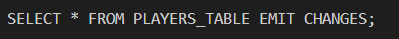

# Kafka Game: Real-Time Multiplayer Dot Collector 🎮

**Experience dynamic multiplayer action fueled by the power of event-driven architecture!** This project showcases the usage of streaming databases for multiplayer games!
We used Apache Kafka, which is an open-source distributed event streaming platform and ksqlDB, a streaming SQL engine.

Watch the gameplay:
*   [
](https://github.com/user-attachments/assets/c9044d53-9faf-48b7-93a1-cc41b833f6e2)
*   [
](https://github.com/user-attachments/assets/14b5228c-6a3e-40f3-872f-85f9f4c15035)
*   [
](https://github.com/user-attachments/assets/fe0cf99c-b3bc-45b8-8e80-86cc611e4da7)


## 🚀 Overview

This is a simple, proof of concept gameplay made just to show how the streaming databases work in multiplayer game solutions. Players control squares, aiming to collect dots that appear randomly. Each collected dot contributes to an individual score, while special dots can affect a shared team score. When a player gets 30 points, he wins. The game uses streams to ensure reliable communication between clients and the server. ksqlDB is employed for stateful stream processing, providing a real-time view of the game state. The entire backend infrastructure is containerized with Docker for easy deployment and management.

## ✨ Key Features

*   **Real-Time Multiplayer:** Engage multiple players simultaneously in a dynamic, shared game environment.
*   **Event-Driven Core:** Utilizes Apache Kafka for robust, decoupled communication, forming the heart of the game's architecture.
*   **Stateful Stream Processing with ksqlDB:** Leverages ksqlDB to transform raw game event streams into tables (`PLAYERS_TABLE`, `DOTS_TABLE`), maintaining an readable game state.
*   **Hybrid Communication Strategy:**
    *   **Fast Path:** Low-latency `GAME_EVENTS_TOPIC` delivers immediate UI updates to clients.
    *   **Authoritative Path:** Server events are fed into ksqlDB to build a consistent game state.
*   **Dockerized Ecosystem:** Kafka, Zookeeper, ksqlDB Server, and ksqlDB CLI are managed via Docker for effortless setup.
*   **Interactive Pygame Client:** A simple graphical client built with Pygame offers an engaging player experience.
*   **Dynamic Scoring Mechanics:** Features individual scores and a shared team score, with different dot types offering varied scoring effects.
*   **Clear "Game Over" Condition:** The game concludes decisively when a player's total score (individual + shared) reaches the 30 points.

## 🏗️ Architecture Deep Dive

The Kafka Game system is a symphony of interconnected components, communicating seamlessly via Kafka topics:

**1. Game Clients:**
    *   The player's window into the game world, crafted with **Pygame**.
    *   Handles graphical rendering, user input (W,A,S,D or arrow keys), and local prediction for smooth avatar movement.
    *   Publishes player actions (e.g., "join", "move") to the `PLAYER_ACTIONS_TOPIC` in the database.
    *   Subscribes to `GAME_EVENTS_TOPIC` for real-time state changes (other players' positions, dot states, score updates, and game over signals).

**2. Game Server (`game_server/server.py`):**
    *   The central system of the game.
    *   Consumes player inputs from `PLAYER_ACTIONS_TOPIC`.
    *   Manages player states (positions, scores, activity), dot lifecycles, collision detection, and win condition evaluation.
    *   Produces events to multiple Kafka topics, ensuring data flows correctly to both clients and ksqlDB:
        *   `GAME_EVENTS_TOPIC`: For broadcasting fast-path updates to clients.
        *   `PLAYER_STATE_UPDATES_TOPIC`: For feeding detailed player state into ksqlDB to build the `PLAYERS_TABLE`.
        *   `DOT_EVENTS_TOPIC`: For publishing dot creation and collection events to ksqlDB for the `DOTS_TABLE`.

**3. Apache Kafka (Managed by `docker-compose.yml`):**
    *   Enables asynchronous communication.
    *   Broker IP and port are configured in `common/config.py`.

**4. ksqlDB (Managed by `docker-compose.yml`):**
    *   A powerful stream processing engine allowing SQL-like queries on real-time Kafka data.
    *   `ksqldb-server`: Executes the stream processing logic.
    *   `ksqldb-cli`: Provides an interactive shell for defining and querying ksqlDB objects.
    *   Consumes from `PLAYER_STATE_UPDATES_TOPIC` and `DOT_EVENTS_TOPIC`.
    *   The `ksql/game_logic.ksql` script defines:
        *   **Streams:** `PLAYER_STATE_UPDATES_STREAM` and `DOT_EVENTS_STREAM` directly mapping to Kafka topics.
        *   **Tables:** `PLAYERS_TABLE` and `DOTS_TABLE` as continuously updated materialized views, representing the canonical, queryable game state.

**5. Docker & Docker Compose (`docker-compose.yml`):**
    *   Simplifies the deployment and management of the entire backend infrastructure (Zookeeper, Kafka, ksqlDB Server, ksqlDB CLI), ensuring a consistent environment.

**Data Flow & Kafka Topics (defined in `common/config.py`):**

*   `PLAYER_ACTIONS_TOPIC`: Client → Server.
*   `GAME_EVENTS_TOPIC`: Server → Client.
*   `PLAYER_STATE_UPDATES_TOPIC`: Server → ksqlDB.
    *   *ksqlDB Stream:* `PLAYER_STATE_UPDATES_STREAM`
*   `DOT_EVENTS_TOPIC`: Server → ksqlDB.
    *   *ksqlDB Stream:* `DOT_EVENTS_STREAM`
*   `PLAYERS_TABLE_TOPIC` & `DOTS_TABLE_TOPIC`: Internal ksqlDB topics backing the materialized tables.

## 💻 Technology Stack

-   **Backend & Game Logic:** Python 3
-   **Client GUI:** Pygame
-   **Messaging Backbone:** Apache Kafka
-   **Stream Processing:** ksqlDB
-   **Containerization:** Docker, Docker Compose
-   **Kafka Python Client:** `confluent-kafka`

## 🛠️ Setup and Installation Guide

**Prerequisites:**
-   Python 3.8+ and `pip`
-   Docker Engine & Docker Compose (Docker Desktop is recommended)
    

**Steps:**

1.  **Clone the Repository:**
    ```bash
    git clone <your-repository-url>
    cd kafka-game
    ```

2.  **❗CRUCIAL: Configure Kafka Broker IP❗**
    Open `common/config.py`. You **MUST** update `KAFKA_BROKER_IP` to your machine's Local Area Network (LAN) IP address. This IP must be reachable by Docker containers and other clients on your network for multiplayer functionality.
    ```python
    # common/config.py
    KAFKA_BROKER_IP = "YOUR_MACHINE_LAN_IP_ADDRESS" # Example: "192.168.1.105"
    KAFKA_BOOTSTRAP_SERVERS = f"{KAFKA_BROKER_IP}:9092"
    ```

3.  **Install Python Dependencies:**
    (Specified in `requirements.txt`)
    ```bash
    pip install -r requirements.txt
    ```

4.  **Launch Dockerized Infrastructure:**
    From the project root:
    ```bash
    docker-compose up -d
    ```
    

    Verify containers are running via Docker Desktop:
    

    Optionally, check ksqlDB server logs for successful startup:
    

5.  **Initialize Kafka Topics:**
    This script (`setup_environments.py`) creates the necessary Kafka topics.
    ```bash
    python setup_environments.py
    ```

6.  **Bootstrap ksqlDB Streams & Tables:**
    a.  Access the ksqlDB CLI:
        ```bash
        docker exec -it ksqldb-cli ksql http://ksqldb-server:8088
        ```
         

      You'll be greeted by the ksqlDB CLI:
      

    b.  Execute the ksqlDB Logic:
        Open `ksql/game_logic.ksql`.
        

        Copy the entire content of `ksql/game_logic.ksql` and paste it into the ksqlDB CLI. Press Enter.
        

        This script defines how ksqlDB processes game data, for example:
        ```ksql
        -- ksql/game_logic.ksql (snippet)
        SET 'auto.offset.reset' = 'earliest';

        CREATE STREAM IF NOT EXISTS PLAYER_STATE_UPDATES_STREAM (
            player_id VARCHAR KEY, username VARCHAR, x DOUBLE, y DOUBLE, score INT,
            shared_score INT, last_seen BIGINT, winner_id VARCHAR, winner_username VARCHAR
        ) WITH (KAFKA_TOPIC = 'player_state_updates', VALUE_FORMAT = 'JSON');

        CREATE TABLE IF NOT EXISTS PLAYERS_TABLE AS
            SELECT player_id, LATEST_BY_OFFSET(username) AS username, LATEST_BY_OFFSET(x) AS x, /* ... more fields */
            FROM PLAYER_STATE_UPDATES_STREAM GROUP BY player_id EMIT CHANGES;
        ```

    c.  Verify Table Creation:
        In the ksqlDB CLI:
        ```ksql
        SHOW TABLES;
        ```
        You should see `PLAYERS_TABLE` and `DOTS_TABLE`.
        

## ▶️ How to Run the Game

1.  **Ensure Docker services are active** (`docker-compose up -d`).
2.  **Confirm Kafka topics & ksqlDB setup is complete.**

3.  **Start the Game Server (`game_server/server.py`):**
    In a new terminal:
    ```bash
    python game_server/server.py
    ```
    
    Watch for logs indicating player joins:
    

4.  **Launch Game Clients (`game_client/client.py`):**
    For each player, open a new terminal (on the same or different machines on the network) and run:
    ```bash
    python game_client/client.py
    ```
    Enter a username when prompted:
    

5.  **Enjoy the Game!**
    Use `W, A, S, D` or `Arrow Keys` to move. Collect dots, watch the scores, and aim for victory!

## 🔍 Inspecting Live Game State with ksqlDB

Peek into the authoritative game state directly via ksqlDB:
1.  Connect to ksqlDB CLI: `docker exec -it ksqldb-cli ksql http://ksqldb-server:8088`
2.  Run live queries:
    View dot states:
    ```ksql
    SELECT * FROM DOTS_TABLE EMIT CHANGES;
    ```
    

    View player states:
    ```ksql
    SELECT * FROM PLAYERS_TABLE EMIT CHANGES;
    ```
    
    

## 🛑 Stopping the Environment

To gracefully shut down and remove all Docker containers, networks, and volumes:
```bash
docker-compose down -v --remove-orphans
```


---

We hope you enjoy playing, exploring, and learning from the Kafka Dot Collector Game!
